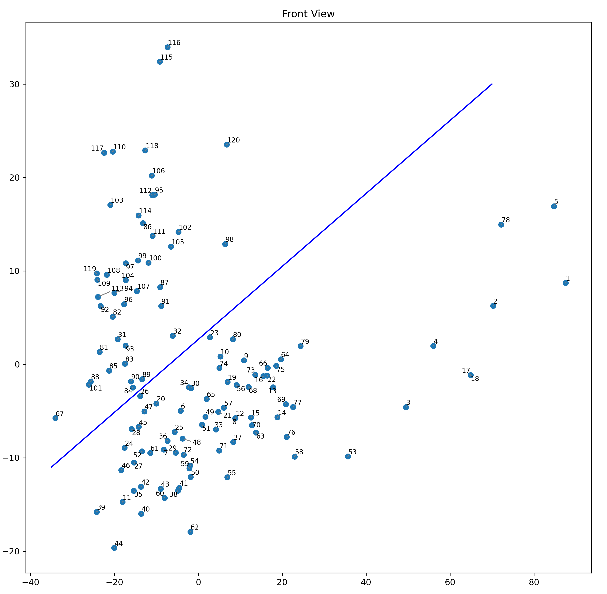
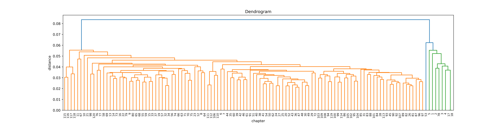

# *The Dream of Red Chamber* and Linguistic Statistics

The Left Dream of the Red Chamber - Who are the authors of *The Dream of the Red Chamber*? Is Hu Shi's theory of the first 80s and last 40s correct? (The Dream of Red Chamber has 120 chapters.)

In 1987, Professor Li Xianping from Fudan University's "A New Account of the Completion of the Dream of the Red Chamber" [1] shook the Redology community with a completely new perspective. At that time, the author described using UWMadison's hardware and software devices to analyze for several months. Today, I spend a day simply reproducing the results of the article on a PC.

In order to obtain high-quality text, we ultimately chose to directly crawl the "Red Chamber Star Saying"(红楼星语) website [2]. I used the Gengchen edition (Peking University Zhipai edition) for 1-80 chapters and the Cheng Yi edition for 81-120 chapters. (Gengchen 17-18 has not been divided, Li Wenzhong split it in half)

*P1 Using each chapter as an observation from 120 chapters, with 44 function words and sentence length as features, the projection on the main plane after corresponding transformation(CA)*

*P2 Systematic cluster diagram using recursive group averaging method, measured by class chi-square distance*

The main arguments presented in [1] are basically consistent with the "front view" and "dendrogram". It can be seen that there is a clear separation between the two parts - the first 80 chapters and the last 40 chapters are likely written by completely different authors.

The highly controversial 1-5 chapters ("Cao's Fifth Review Theory"), 17-18 chapters, and 53 chapters have all received certain support.

Looking at the details, the first 80 and the last 40 are not completely integrated. Li's article also made many radical statements: the first 80 was inserted from the anonymous "Records of the Stone"(石头记) and Cao Xueqin's "Fengyue Baojian"(风月宝鉴); And the specific list of three additions and deletions; The latter 40 was not solely composed of Gao E as claimed by Hu Shi, but was supplemented by the Cao family based on posthumous manuscripts, then compiled by Cheng Weiyuan and proofread by Gao E; But at the same time, he avoided the questions raised by Zhiyanzhai, Cao Fu, and other hypothesis. Afterwards, there was a lot of discussion on the viewpoints and methodology of this article.

**reference**

[1] 李贤平. (1987). 《红楼梦》成书新说. Fu Dan Xue Bao. She Hui Ke Xue Ban, (5), 3-16.

[2] http://www.redmansions.net/

[3] 施建军. (2010). 关于以《红楼梦》120回为样本进行其作者聚类分析的可信度问题研究. Hong Lou Meng Xue Kan, (5), 318-335.

[4] 潘旭澜. (1987). 序《成书新说》. Fu Dan Xue Bao. She Hui Ke Xue Ban, (5), 17-18.

[5] 碧峰. (1988). 《〈红楼梦〉成书新探》讨论会简述. Fu Dan Xue Bao. She Hui Ke Xue Ban, (1), 111-112.

---

Download：

{download}`Text of The Dream of Red Chamber <./text.zip>`（text crawled from the website and dirty text converted from e-books, including Gengchen edition, Cheng Yi edition, contemporary annotated edition, and Zhiping proofread edition）

{download}`Code <./code.zip>`（*Python*，including the crawler, analysis and variables）
