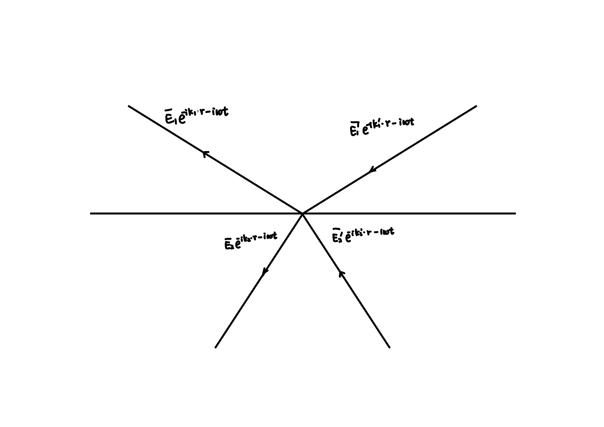

# Stokes Formula

Assuming there are four planar electromagnetic waves above and below a certain interface, and the incident and exitant electromagnetic waves in medium 1 are $\vec {E}_ {1} , \vec {E}_ {1} ^ {\prime} $, the incident and exitant electromagnetic waves in medium 2 are $\vec {E}_ {2} , \vec {E}_ {2} ^ {\prime} $.

$$
\begin{array}{l}
\vec{E}_{1} = \mathrm{Re}{( \vec{E}_{1} e^{ i \vec{k}_{1} \cdot \vec{r} - i \omega t } )} \\
\vec{E}_{1}^{\prime} = \mathrm{Re}{( \vec{E}_{1}^{\prime} e^{ i \vec{k}_{1}^{\prime} \cdot \vec{r} - i \omega t } )} \\
\vec{E}_{2} = \mathrm{Re}{( \vec{E}_{2} e^{ i \vec{k}_{2} \cdot \vec{r} - i \omega t } )} \\
\vec{E}_{2}^{\prime} = \mathrm{Re}{( \vec{E}_{2}^{\prime} e^{ i \vec{k}_{2}^{\prime} \cdot \vec{r} - i \omega t } )}
\end{array}
$$

For simplicity, $\mathrm{Re}$ and $\vec{E}$ are ignored below. When using $\bar{E}$ to denote back-propagation, When $\bar{E}_{i}^{\prime} = E_{i}$, $\bar{E}_{i} = E_{i}^{\prime}$. The amplitude reflectivity and amplitude refractive index at the interface are defined as

$$
\begin{array}{l}
r_{1} = \frac{E_{1}^{\prime}}{E_{1}} & E_{2} = 0 \\
t_{1} = \frac{E_{2}^{\prime}}{E_{1}} & E_{2} = 0 \\
r_{2} = \frac{E_{2}^{\prime}}{E_{2}} & E_{1} = 0 \\
t_{2} = \frac{E_{1}^{\prime}}{E_{2}} & E_{1} = 0
\end{array}
$$

If the reflection and refraction on the interface are caused by the difference in upper and lower refractive indices, and the phase shift is caused by Maxwell's equations, then it satisfies

$$
\begin{array}{l}
r_{1} + r_{2} = 0 \\
r_{1}^{2} + t_{1} t_{2} = 1
\end{array}
$$

If the equivalent reflection and refraction coefficients of the dielectric plate are represented, and the phase shift is caused by the optical path difference inside the dielectric plate, then it satisfies

$$
\begin{array}{l}
r_{1} r_{1}^{*} + t_{1}^{*} t_{2} = 1 \\
r_{1}^{*} t_{1} + r_{2} t_{1}^{*} = 0
\end{array}
$$

### Equivalent coefficient at the interface of the medium

Taking s-light as an example, the boundary conditions of Maxwell's equations are

$$
\begin{array}{l}

\varepsilon_{r1} \cdot 0 = \varepsilon_{r2} \cdot 0 \\

E_{1s} + E_{1s}^{\prime} = E_{2s} + E_{2s}^{\prime} \\

B_{1s} \sin \theta_{1} + B_{1s}^{\prime} \sin \theta_{1}^{\prime} = B_{2s} \sin \theta_{2} + B_{2s}^{\prime} \sin \theta_{2}^{\prime} \\

B_{1s} \cos \theta_{1} - B_{1s}^{\prime} \cos \theta_{1}^{\prime} = B_{2s} \cos \theta_{2} + B_{2s}^{\prime} \cos \theta_{2}^{\prime} \\

k_{1} E_{1} = \omega B_{1} \quad k_{1} E_{1}^{\prime} = \omega B_{1}^{\prime} \quad k_{1} = \sqrt{\varepsilon_{r1}} \frac{\omega}{c} \\

k_{2} E_{2} = \omega B_{2} \quad k_{2} E_{2}^{\prime} = \omega B_{2}^{\prime} \quad k_{2} = \sqrt{\varepsilon_{r2}} \frac{\omega}{c}

\end{array}
$$

Consider the electromagnetic waves in the time space at $t=0$, so if all $k$ and $B$ are reversed, then all $E$ remain unchanged and the above equation still holds. Pay attention to the $E_{1} $ in the previous two images may not necessarily be equal, but it is guaranteed by Maxwell's system of equations that equality may occur. The surface of the medium has only two degrees of freedom (only two beams of light can be arbitrarily sized).

### Equivalent coefficient of dielectric plate

The phase shift of the dielectric plate comes from the internal optical path. Taking the dielectric thin film as an example, when $E_{2} =0$,

$$
\begin{array}{l}
E_{1}^{\prime} = E_{1} ( r + t r^{\prime} t^{\prime} e^{i \Delta \varphi} ( \sum_{j = 0}^{\infty} [ r^{\prime 2} e^{i \Delta \varphi}]^{j} ) ) \\
E_{2}^{\prime} = E_{1} ( t t^{\prime} e^{i \Delta \varphi^{\prime}} \sum_{j = 0}^{\infty} [ r^{\prime 2} e^{i \Delta \varphi}]^{j} ) \\
\end{array}
$$

Consider the electromagnetic waves in the time space at $t=0$, so if all $k$ and $B$ are reversed, then all $E$ remain unchanged. Due to the inverse sign of all $\Delta \varphi $ in ray backpropagation, $r, t, r ^ {\prime}, t ^ {\prime} $are real numbers, therefore the new $\bar {E}_ {1} , \bar {E}_ {1} ^ {\prime}, \bar {E}_ {2} , \bar {E}_ {2} ^ {\prime} $ satisfies the original relationship between  $E_ {1} ^ {*}, E_ {1} ^ {\prime*}, E_ {2} ^ {*}, E_ {2} ^ {\prime*} $.

### Construction

Assuming there is only $E _ {1} =1 $ initially incident, resulting in $E_ {1} ^ {\prime}=r_ {1} , E_ {2} ^ {\prime}=t_ {1} $.

**For the interface between two media**

1. Construct $\bar {E}_ {1} ^ {\prime}=r_ {1} $, generating $\bar {E}_ {1} =r_ {1} ^ {2}, \bar {E}_ {2} =r_ {1} T_ {1} $.  The same amplitude maintained when reverse the light rays.
2. Reconstruct $E_ {2} ^ {\prime}=t_ {1} $, similar to having $E_ {1} =t_ {1} T_ {2} , E_ {2} =t_ {1} R_ {2} $. The superposition of these two situations is the initial situation.

$$
\begin{array}{l}
r_{1}^{2} + t_{1} t_{2} = 1 \\
r_{1} t_{1} + t_{1} r_{2} = 0
\end{array}
$$

**For the equivalent coefficient of the dielectric plate**

1. Construct $\bar {E}_ {1} ^ {\prime}=r_ {1} ^ {*} $, then the outgoing light is $\bar {E}_ {1} =r_ {1} ^ {*} r_ {1} , \bar {E}_ {2} =r_ {1} ^ {*} t_ {1} $. Reverse to $E_ {1} ^ {\prime}=r_ {1} , E_ {1} =r_ {1} R_ {1} ^ {*}, E_ {2} =r_ {1} T_ {1} ^ {*} $.
2. Similarly, construct $E_ {2} ^ {\prime}=t_ {1} , E_ {1} =t_ {1} T_ {2} ^ {*}, E_ {2} =t_ {1} R_ {2} ^ {*} $.

$$
\begin{array}{l}
r_{1} r_{1}^{*} + t_{1} t_{2}^{*} = 1 \\
r_{1} t_{1}^{*} + t_{1} r_{2}^{*} = 0
\end{array}
$$

### The following proposition holds

The electric field vector and magnetic field vector of two opposite beams of light cannot be simultaneously eliminated.

For the interface of the medium, if $E_{1} e^{ i \vec{k}_{1} \cdot \vec{r} - i \omega t }, E_{1}^{\prime} e^{ i \vec{k}_{1}^{\prime} \cdot \vec{r} - i \omega t }, E_{2} e^{ i \vec{k}_{2} \cdot \vec{r} - i \omega t }, E_{2}^{\prime} e^{ i \vec{k}_{2}^{\prime} \cdot \vec{r} - i \omega t }$ is allowed, then $E_{1} e^{ - i \vec{k}_{1} \cdot \vec{r} - i \omega t }, E_{1}^{\prime} e^{ - i \vec{k}_{1}^{\prime} \cdot \vec{r} - i \omega t }, E_{2} e^{ - i \vec{k}_{2} \cdot \vec{r} - i \omega t }, E_{2}^{\prime} e^{ - i \vec{k}_{2}^{\prime} \cdot \vec{r} - i \omega t }$ is allowed.

For the dielectric board, if $E_{1} e^{ i \vec{k}_{1} \cdot \vec{r} - i \omega t }, E_{1}^{\prime} e^{ i \vec{k}_{1}^{\prime} \cdot \vec{r} - i \omega t }, E_{2} e^{ i \vec{k}_{2} \cdot \vec{r} - i \omega t }, E_{2}^{\prime} e^{ i \vec{k}_{2}^{\prime} \cdot \vec{r} - i \omega t }$ is allowed，then $E_{1}^{*} e^{ - i \vec{k}_{1} \cdot \vec{r} - i \omega t }, E_{1}^{\prime *} e^{ - i \vec{k}_{1}^{\prime} \cdot \vec{r} - i \omega t }, E_{2}^{*} e^{ - i \vec{k}_{2} \cdot \vec{r} - i \omega t }, E_{2}^{\prime *} e^{ - i \vec{k}_{2}^{\prime} \cdot \vec{r} - i \omega t }$ is allowed.
