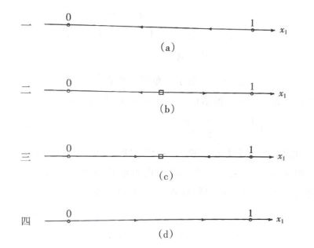

# Frivolity: Love in Evolution and Equilirium

### 暧昧：进化与均衡

（本周分享的算是一个失败的建模，但话题有趣嘿嘿）

这个模型描述了两个个体（男女）在暧昧阶段的互动（博弈）。不过博弈可能给人感觉怪怪的——原因是我们这里假设两人都在努力最大化自己的关于爱的效用，并规划和调整自己的做法。

$t$ 时刻博弈双方的状态记作 $x(t)=(x_1(t), x_2(t)) \in [0,1]^2$ ，表示男方和女方的爱意。同时他们的行动（一些或直白或隐晦的示爱的方式）$a(t)=(a_1(t), a_2(t)) \in [0,1]^2$ ，其中 $0$ 代表没有示爱，$1$ 代表直球表白。当然对于未来，我们对时间价值做了一个折现率 $r$ 。

状态过程（dynamics）：

$$
\dot{x_1} = (\frac{a_2}{a_1}-\delta)x_1 \\
\dot{x_2} = (\frac{a_1}{a_2}-\delta)x_2
$$

目标（optimal control）：

$$
U_i = \max\limits_{a} \int_0^T x_i(t)e^{-rt}dt + D(x(T))
$$

（理论上应加上 $\lim\limits_{T\rightarrow \infty}$；这样终态效用 $D$ 就比较直接，比如或许是一个狄拉克函数，只在未来能配对成功的 $(1,1)$ 点取到无穷）

但爱情真是一个复杂的东西（笑），高冷人设和舔狗人设的效用函数大概率是非常不一样的。我们这里仅仅设想一种 Platonic Love，有着逻辑清晰简单的个体爱意作为效用——即自我的爱意就是感受到的幸福。并且这个爱意随着双方对白的互动可以得到增强和减弱；从式子可以看到真正影响人的是比值 $\frac{a_1}{a_2}$，对方超额的行为才能进一步增加你的爱意并引发你的进一步互动（我经过深思熟虑认为导数比值 $\frac{\dot{a_1}}{\dot{a_2}}$ 更为合适，但接下来的解析将过于复杂）；同时设置了一个“折旧率” $\delta$ 作为没有足够互动之后与日俱减的爱情（想来有人会说……君子之交淡如水）。

好的那我们继续，构造哈密顿量

$$
\mathcal{H} = \nabla_x V \cdot \dot{x}(t,x(t),a(t))+u_i(t,x(t),a(t))\\
= x_1(\frac{a_2}{a_1}-\delta) \frac{\partial V}{\partial x_1}+x_2(\frac{a_1}{a_2}-\delta) \frac{\partial V}{\partial x_2}+x_i(t)e^{-rt}
$$

有微分博弈常用的 HJB 方程

$$
\nabla_t V(x(t),t) + \max\limits_{a} \mathcal{H}(t,x(t),a(t)) = 0
$$

其中 $V(x(t),t)$ 为价值函数。最值化的 $a$ 满足

$$
\nabla_a \mathcal{H} = 0
$$

代入得到

$$
\frac{a_1^2}{x_1V_{x_1}} = \frac{a_2^2}{x_2V_{x_2}}
$$

由于对称性，纳什均衡的两个 HJB 要求 $x_1 e^{-rt} = x_2 e^{-rt}$。对于双方开始时 $x_1(0) \neq x_2(0)$，我们发现不存在纳什均衡——男女双方总有一方没有满意——爱情真是折磨人（笑）。

还可能效用需要考虑双方示爱的付出，即目标改为

$$
U_i = \max\limits_{a} \int_0^T (x_i(t)-a_i(t))e^{-rt}dt + D(x(T))
$$

这样得到

$$
a_1 = a_2 \sqrt{\frac{x_1V_{x_1}}{x_2V_{x_2}-a_2e^{-rt}}}
$$

按照 $a_1$ 和 $a_2$ 的对称性，两式联立可以发现均衡是解不出来的（负数）——我们仍然无法让男女双方都保持满意。

（更精细的设置和解就不讨论了）

让我们再来看看一个有大量单身男女的自由且频繁互动的婚恋市场（笑）。为了简便起见，我们把原本的微分博弈化归作一个选择主动表白/等待被表白的静态矩阵博弈。群体重复进行大量这样的博弈，策略 $i$ 的复制动态为

$$
\dot{x_i} = (u(e^i,x)-u(x,x))x_i
$$

*（$x_i$ 表示群体中选择 $i$ 的比例，其增长或减少受到选择该行动得到收益与群体平均收益的差值）*

$2\times 2$ 矩阵博弈有四种形态，其演化形式为

如果不是囚徒博弈（上图的一或四）而是鹰鸽博弈（斗鸡博弈，即你进我退或我退你进是最好选择），那么我们看到（上图的三）最终人们会演化到一个稳定的混合策略比例，一部分人主动表白，一部分人做接受。

不过等一下，如果我们分了男女两个群体并假定只有男女两个性别（笑），同时复制动态中的群体平均值改为本群体和对面群体博弈收益的平均值，这个多群体演化模型的相图变成

.jpg)

原本的单群体模型位于 $45^{\circ}$ 线上，但这里中间的混合策略是一个不稳定的鞍点。最终要么男生追求女生，要么女生追求男生（到达两个角点）。（是江西天价彩礼现象的一种可能的解释吗？）当然群体再细分兴许会更好。

（好的总的来看，这篇讲的内容完全不接近现实……数学在人心面前显得无能为力——有些超越理性的东西我们称之为情感。）
