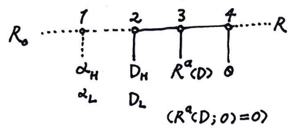

# Frivolity: Dividend Signaling Model

### 一个股利信号模型

来尝试做一个可以解释正向 / 反向股利信号的模型。我这里叫正向指的是公告发放股利后，公司股价上升的情况，即投资者认为是公司盈利好、富裕现金多的信号；反向信号即公告后股价下跌。

模型的设定如下：

我们纳入代理问题的考量。存在投资者（外部股权）和内部代理人（经理，可能持有股份）两方，公司正在经营一个新项目。这里关键的假设有：风险中性（贝叶斯均衡）；风险项目的产出简化为两点分布，以一定概率 $\alpha$ 获得现值 $R$，$1-\alpha$ 概率亏空为 $0$；私人收益线性函数（见下）。

当下第一期实现了收入 $R_0$，但之后仍然存在风险：好项目获得 $R$ 的概率为 $\alpha_H - \tau \theta$（$0$ 的概率为 $1-\alpha_H+ \tau \theta$），坏项目获得 $R$ 的概率为 $\alpha_L - \tau \theta$，且 $\alpha_H > \alpha_L$。其中 $\theta$ 为经理的偷懒程度，$\theta \in [0,1]$，$\theta = 0$ 为认真工作；$\tau$ 表示了偷懒对项目经营的危险程度。

这里的信息不对称表现为外部投资者不清楚 $\alpha$ 并赋以 $\alpha_H$ 概率 $\gamma$（$\alpha_L$ 概率 $1-\gamma$），而经理知道自己是 $\alpha_H$ 还是 $\alpha_L$。经理决定股利分配政策，实施发放股利 $D$，为市场所观测。之后由董事会（投资者控制）决定经理报酬方案 $R^a$（根据信号 $D$ 和未来项目收入 $R$ 获得报酬，即 $R^a(D,R)$ 且默认失败没有补偿 $R^a(D,0) = 0$）。最后项目执行，经理选择 $\theta$ 并最终依概率得到 $R$ 或 $0$。（流程可见上图）

当一部分当期收入作为股利时，另一部分留存收益 $R-D$ 将进行再投资，这会提高未来的产出。我们假设如果项目成功的话，现值

$$
R = \frac{R_0}{\mu} + \beta (R-D)(1-w\theta)
$$

其中 $\mu$ 为折现率，通常 $\mu = WACC$；$\beta$ 为总投资回报率，通常 $\beta = \frac{ROIC}{WACC} > 1$（公司有盈利能力）。$w\theta (R-D)$ 为代理成本（与留存收益成正比），$w$ 代表了代理问题的严重性（挪用现金比例上限）。

经理的效用函数为 

$$
U_a=\eta D+(\alpha-\tau \theta) R^a(D)+ \left(w\left(R_0-D\right)+R_w\right) \theta
$$

其中 $\eta$ 为经理原持股比例，得到分红的一部分。私人收益函数 $w(R_0-D)+R_w$，常数项 $R_w$ 是怠工本身（如休闲）带来的效用。注意第二项为未来项目带来的薪酬预期（失败为 $0$）。

投资者的效用函数为

$$
U_{i}=(1-\eta) D+(\alpha-\tau \theta)\left(\frac{R_0}{\mu}+\beta\left(R_0-D\right)(1-\omega \theta)-R^a(D)\right)
$$

以上 $R_0, \mu, \alpha_{H/L}, \beta_{H/L}, w, R_w, \tau, \eta, \gamma$ 均为共同知识。我们这里假设了很多线性形式，可以料到最值会处在两极。

先来看最后一步，我们认为经理不会怠工。这个激励合约需要满足的条件：

$$
\begin{aligned}
& \text { Step 4. } U_a=\left(w R_0+R_w-w D-\tau R^a\right) \theta+\alpha R^a+\eta D \\
& \max U_{a} \Rightarrow R^a(D) \geqslant \frac{w}{\tau}\left(R_0-D\right)+\frac{R_w}{\tau}, \theta=0 \\
& (\alpha-\tau)\left(\frac{R_0}{\mu}+\beta\left(R_0-D\right)(1-w)\right) \leqslant \alpha\left(\frac{R_0}{\mu}+\beta\left(R_0-D\right)-\frac{w\left(R_0-D\right)+R_w}{\tau}\right) \\
& \text { loose } \alpha w \leqslant \tau^2\left(\frac{1}{\mu}+\beta\right)
\end{aligned}
$$

最后的不等式条件说明怠工成本应比较大或项目价值足够大。

考虑混同均衡：

$$
\begin{aligned}
& \text{ Pooling Equilibrium: }D_H=D_L=D \\
& \max U_{i} \Rightarrow R^a(D)=\frac{w\left(R_0-D\right)+R_{w}}{\tau} \\
& \text { Step 2. } U_a=\eta D+\frac{\alpha \omega}{\tau}\left(R_0-D\right)+\frac{\alpha R_w}{\tau}+R_w+w\left(R_0-D\right) \\
& =\left(\eta-\frac{\alpha+\tau}{\tau} w\right) D+\left(w R_0+R_{w}\right) \frac{\alpha+\tau}{\tau} \\
& \Rightarrow D=R_0 \text { or } 0\\
\end{aligned}
$$

（若持股比较大则 $D=R_0$，反之为 $0$）

我们希望现实中的信号情形为分离均衡。但由于 $R^a(D,R)$ 函数未定，均衡数量恐怕不少。考虑一种常见的方式——股权激励 $R^a = \eta' R$，$\eta'_{H/L}$ 为未来允诺的持股比例。

在混同均衡下，有

$$
\begin{aligned}
& R^a(D)=\eta^{\prime}\left(R_0\left(\frac{1}{\mu}+\beta\right)-\beta D\right) \\
& \text{then } D=R_0, \eta_H^{\prime} = \frac{R_w \mu}{R_0 \tau} \text{ or }  D=0, \eta_L^{\prime} = \eta_H^{\prime} + \mu(\frac{w}{\tau} - \beta_L)
\end{aligned}
$$

而分离均衡的出现要求

$$
\begin{aligned}
& \text{ Separating Equilibrium: } \\
& \text { Step 2. } U_a=\alpha R^a(D)+\eta D \\
& \qquad\quad =\left(\eta-\eta^{\prime} \alpha \beta\right) D+\eta^{\prime} \alpha R_0\left(\frac{1}{\mu}+\beta\right) \\
& \Rightarrow \left(\eta^{\prime} \alpha \beta\right)_L>\eta>\left(\eta^{\prime} \alpha \beta\right)_H \text{ or } \left(\eta^{\prime} \alpha \beta\right)_H>\eta>\left(\eta^{\prime} \alpha \beta\right)_L \\
& \text{ corresponding to }\left\{\begin{array} { l } 
{ D _ { H } = R _ { 0 } } \\
{ D _ { L } = 0 }
\end{array} \text{ or } \left\{\begin{array}{l}
D_H=0 \\
D_L=R_0
\end{array}\right.\right. \\
&
\end{aligned}
$$

简便起见，我们令 $\beta_L = \frac{w}{\tau}$ 即最低工资，这样 $\eta'_H = \eta'_L = \eta$，持股比例不变。两种情况（正向 / 反向）对应 $\alpha_L \beta_L>1>\alpha_H \beta_H \ / \ \alpha_L \beta_L<1<\alpha_H \beta_H$。

我们假设投入好项目的总值一定胜过投入坏项目，即 $\alpha_L R_0\left(\frac{1}{\mu}+\beta_L\right)<\alpha_H R_0\left(\frac{1}{\mu}+\beta_H\right)$。但边际产出 $\alpha_H \beta_H$ 与 $\alpha_L \beta_L$ 关系并不明确——对于成熟的项目和公司，$\alpha_L \beta_L > \alpha_H \beta_H$；而对于新兴领域的项目和公司，$\alpha_H \beta_H > \alpha_L \beta_L$，好项目机会急需资金扩张。

于是我们看到，正向和反向的股利信号都有可能出现。

考虑股利发放公告公布前公司的股权市值：

$$
\begin{aligned}
V_0 & = \gamma\left(D_H+\alpha_H\left(\frac{R_0}{\mu}+\beta R_0-\beta D_H\right)\right) \\
& \quad +(1-\gamma)\left(D_L+\alpha_L\left(\frac{R_0}{\mu}+\beta R_0-\beta D_L\right)\right) \\
& = \gamma V_H+(1-\gamma) V_L
\end{aligned}
$$

公告后市值 $D_H \rightarrow V_H$ 或 $D_L \rightarrow V_L$。

结合前面的系数条件，我们不难得到总是有 $V_H > V_0 > V_L$。

反向股利信号真的存在吗？微软自1986年IPO后，迅速成长，很多年采取零股利政策。2003年，微软第一次宣布派发现金股利，公司股价却一度下跌。
