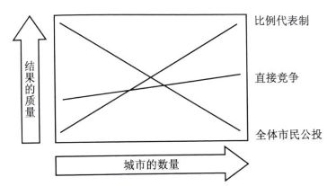

# Frivolity: Annealed Polity Emerges

### 左右退火，政治飞升

我们设想有两座城市，城市里的人分为喜欢靠左走路和喜欢靠右走路两种。而城市需要规定马路要靠左或者靠右走。现在两个城市各有五个市民，三个喜欢靠左，两个喜欢靠右。如果我们采取全民公投（采纳半数及以上），那么两个城市都会选择靠左，每座城市都有两个人没有得到满足。（来自 Tiebout 模型，尽管其用以说明公共产品可以像私人产品一样由社区提供，但这里换一个不同的视角）

设想市民可以低成本的在两个地方迁徙。比如因为某种原因，一个城市的靠右走居民跑到另一个来了，现在三比四（三比三也可），于是这个城市便选择靠右走，而原本那个城市仍然靠左。这就把现在这里的三个靠左走的居民全气跑了，他们迁到了那个左走的城市里——现在所有人都满意了。

我想说的是什么呢？原本这个模型阻滞在一个并非最优的状态里。通过允许迁移的突变，系统进入了一个更优解。复杂系统由大量个体交互连结而成，此处系统作为一个整体需要决定如何处理靠左走还是靠右走的议题，如何在城市间妥善配置市民，这里会产生均衡，会有动力学，也会有循环、控制与混沌，这是原本个体的理论所无法预见且解释的。个体的行为学、心理学与群体的社会学、政治学仍然存在巨大的鸿沟，我们需要新的方法、新的科学范式。

当然可以扩大这个问题。可以有很多很多的市民，很多很多的城市与议题，还可以有各种各样的决策机制。计算机模拟给出了这样的结果：

（‘直接竞争’指党派竞争，由获胜党的纲领决定。‘比例代表制’为多党各占据一定席位，且按比例部分实施其纲领。）

我们知道远离非平衡态的热力学结构保持自组织的条件之一即是涨落。（Dissipative system by Prigogine, 1977 Nobel Prizer. ${\frac  {dV(x(t))}{dt}}\leq u(t)\cdot y(t)$ ）优秀的机制应该能在市内偏好异质时诱发更大的调整，在近于同质时具有稳定的负反馈。

我们已经看到，引入结构工整的噪声能导向更优的均衡、更具鲁棒性的状态。随着市民配置逐渐合理，城市机制将促使政策更加吻合相对同质的市民们的偏好，逐渐退火系统行为。（退火：将金属加温到高于再结晶温度的某一温度并维持一段时间，破坏了内部原子间的排列顺序，然后缓慢冷却，释放残留内应力，产生更加紧密的结构。算法中早有借鉴。）毋庸置疑，计算模型下的复杂系统给予了我们更广的视角。不过我们习惯了形式化的建模和基于第一性原理的理论，可能一时不愿接受也无法理解计算系统带来的结论和发现。

政治的本义（严格说，始终没有一个确切公认的定义——wiki）大概包括由个人及团体组成的集体的组织制度、治理监管、利益分配等作用关系。借某游戏名言“血肉苦弱，机械飞升”，标题想表达的即是一个社会复杂系统研究的视角：无数人类个体交互而成的复杂系统，含有一系列类似左右的议题，这个耗散结构在局部平稳实又混沌的变动和争斗中演化、自组织，那些退火过的结果方能优良而长久。这是系统的涌现（Emergence）、文明的飞升。

**Reference**

Miller, J. & Page, S. (2007). *Complex Adaptive Systems: An Introduction to Computational Models of Social Life*. Princeton: Princeton University Press.