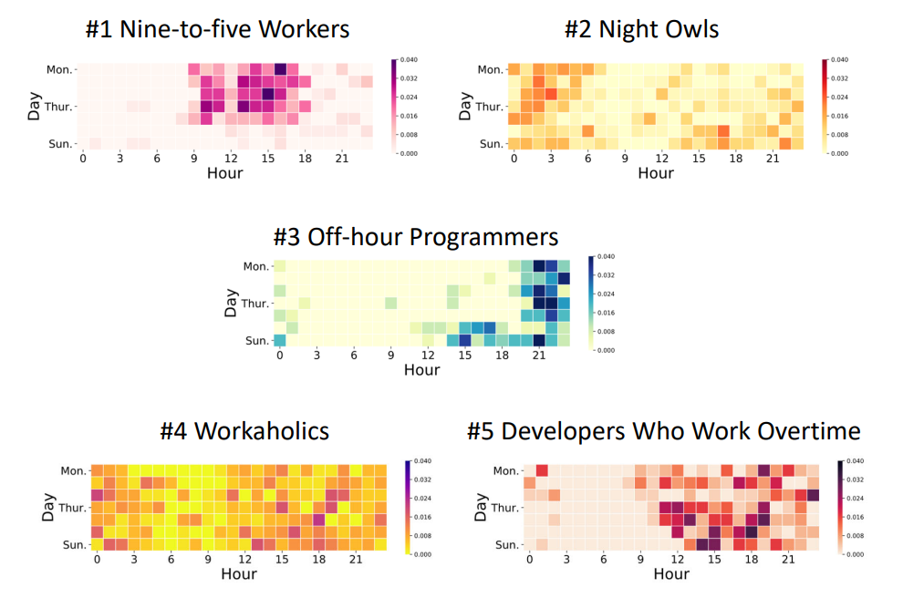

# Frivolity: WeRun Pattern

### 步数模式

晚上有时候会看微信步数榜单，大概能注意到很多人的步数是有规律的。步数能告诉一个人的多少信息？（两万以上可能在出游，一千以下大概率是没出门啦！）

我想一周中各时段的步数变化大概是有规律的（天的变化、一天中的变化）。波动不大的话可能还可以预测某个人明天的步数。（当然由于我列表里学生较多，寒暑假等大时段背景也要考虑。）不同人步数的模式不同，是不是可以提取出典型的因子呢？每个人由这些因子按一定权重组成。（比如上班族：周一到周五上下午有通勤的步数；夜跑族：晚上有运动；学生族：饭点步数，假期可能宅家等等）还可以结合对应好友的朋友圈来解释某些步数特征或异常点（旅游去了之类的）。反过来，是不是可以根据一个好友步数模式的情况推断他是上述哪种类型的人？（准确率多高呢？等我统计几个星期再来😋！）

（……这个话题并不新鲜，甚至是老套路）这让我想起一个有人做的类似的主题，大概是对Github上的程序猿们的工作时间图（contribution graph on your profile）作了统计聚类，大致有这么些典型形态：

（而我，是周五一条线😋）

**插播：Ad Hoc Theory and Tautology**

关于”23.7.7 优秀的博弈家“那篇，突然发现张五常的《经济解释》里讲述了相近的内容（第一卷第三节），即两个极端——特殊理论与套套逻辑。一个优秀的理论必然要介于二者之间。